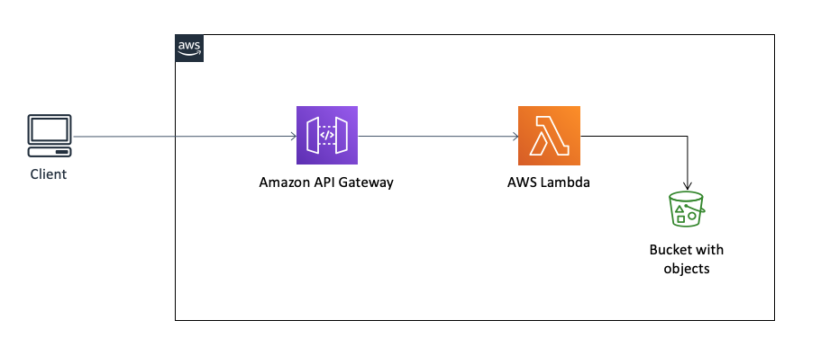

# Deploy AWS Lambda (Node.js) with Serverless and read data from S3

## Description
This is the repository for my medium articel ['Deploy AWS Lambda (Node.js) with Serverless and read data from S3'](http://github.com) so please read it before to get all the details.
Based on the Serverless Framework this piece of software creates a REST API on AWS which reads a .csv file from S3, convert it into JSON and sends it back to client. To read more details about the Serveless Framework visit the [documentation for Serverless Framework on aws](https://serverless.com/framework/docs/providers/aws/).

## Architecture


## Prerequisite
- AWS Account
- Serverless Framwork (latest version)
- Node.js (10.x or higher)

## Installation
Clone the repository on your local machine.

Installl Serverless Framework:

```
npm i -g serverless
```

Set AWS account you want to deplyo to:
```
sls config credentials --provider aws --key <YOUR_KEY> --secret <YOUR_SECRET>
```

Install required packages from packages.json:
```
npm install
````

## Deployment
Before deploying it by yourself you need to do some ajustments regarding your environment on AWS.

Add your Bucket and Key in handler.js:
```JavaScript
const params = {
  Bucket: 'YOUR_BUCKET_NAME', // e.g mytestbucket
  Key: 'YOUR_FILE' // e.g. test.csv
}
  ```


Add your Lambda-Execution-Role in serverless.yaml: 
```yaml
provider:
  name: aws
  runtime: nodejs10.x
  stage: dev
  region: eu-west-1
  stackName: my-lambda-${self:provider.stage}
  role: # Place your lambda-exectution-role (ARN) here
  ```

Now deploy it (esure you are in your project directory):
```
sls deploy
```